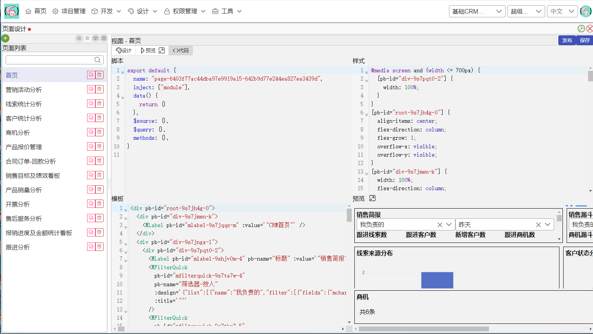

# 1. 概述

官网：https://www.xiumasoft.cn/

码小螈开发平台是码小螈科技有限公司旗下打造的一款基于nestjs+vue.js的低代码开发平台。专注打造方便开发人员及业务人员使用的代码开发平台，致力于帮助企业落实个性化定制系统，实现数字化升级并达到降本增效的目的。

# 2. 架构

采用基于docker容器的微服务架构。有passport、oss等中台应用支撑。

内置中间件使得开发者只需专注于业务开发。框架的安全性、性能优化交由码小螈开发团队完成。

# 3. 功能展示

## 3.1. 数据建模

数据建模支持各种类型的数据：包括单行文本、多行文本、数值、日期、拥有（实体）、属于（实体）、公式等

公式编辑

公式会自动实现数据更新，依赖的数据进行更新时会触发其更新

## 3.2. 功能建模

表单建模

通常低/无代码平台仅支持表单建模，我们的功能建模可以实现无界面运行代码的。可以是单纯的前端功能，也可以是驱动数据变动的表单功能。

审批流程

审批流程需要有提交节点，单纯的前端功能并不会进入审批流程。

## 3.3. 打印模板

## 3.4. 图表生成

## 3.5. 自定义页面
UI设计模式

通过拖拉拽、和设置属性，可以生成各种UI界面

代码模式

码小螈开发平台深度整合vue2框架，使得拖动设计和代码能相互转化

## 3.6. 接口开发
用于开发自定义接口

Postman Like Tester
